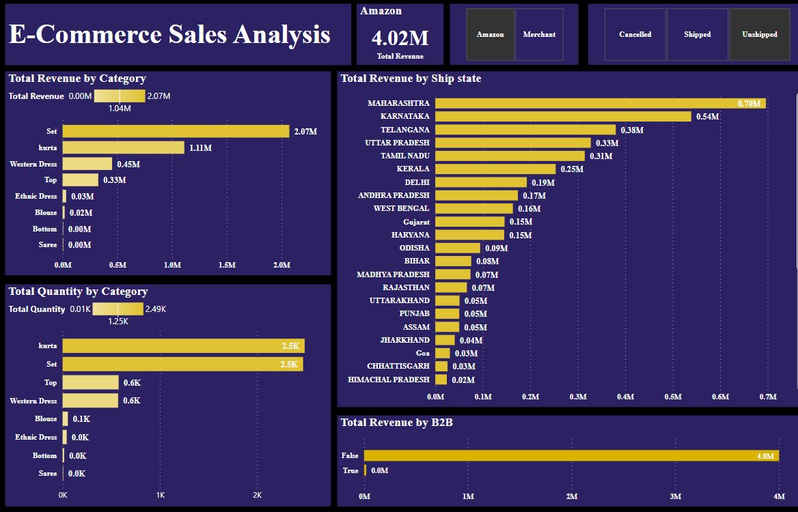

# E-Commerse Sales Analysis

## Introduction:
#### This is a Power BI project on E-Commerse Sales analysis in **india**. This dataset provides a comprehensive overview of e-commerce sales data from different channels  covering a variety of products. The project is to analyze and derive insight to answer crucial questions and drive decision making.
---

## Data Source: 
   #### The data is gotten from Kaggle 
---

## Problem Statement:
1. Analyse Total Sales revenue by product category for each fulfilment (Amazon and Merchant) with respect to shipped and unshipped product ordered
2. Analyse Total quantity by product category for each fulfilment (Amazon and Merchant) with respect to shipped and unshipped product ordered
3. Analyse the state with the highest product quantity order and total revenue with respect to shipped and unshipped product ordered
4. Analyse which business method (B2B or B2C) contribute more to total revenue with respect to shipped and unshipped product ordered

## Skills/ Concept demonstrated:

The following Power BI features were incorporated:
- DAX,
- Quick measures,
- Modelling,
- Filters

## Modelling
Automatically derived relationships are adjusted to remove and replace unwanted relationship with the required

---
There are 10-dimentional tables and 1 fact table. The dimention tables are all joined to the fact table

## Visualization and Analysis:

Analyzing Total Sales revenue by product category for **Amazon**  with respect to shipped product ordered

- The above shows the product category with their total revenue from the highest to the lowest where the product category for **_set_** shows a significant total revenue 
  generated compare to other category but total quantity order for **_set_** and **_kurta_** are the same with total of 31,000 product ordered for **_Amazon_**.
- The analysis indicate location with the highest order of product to the lowest,
- The analysis indicate **B2B** method of business is not major contributor to total revenue generated but possible **B2C** which shows a large significant as a contributor 
  to total revenue generated
---

Analyzing Total Sales revenue by product category for **Merchant**  with respect to shipped product ordered

- The above shows the product category with their total revenue from the highest to the lowest where the product category for **_set_** shows a significant total revenue generated compare to other category but total quantity order for **_set_** is slightly more than that of **_kurta_**  for **_Merchant_**
- The analysis indicate location with the highest order of product to the lowest.
- The analysis indicate **B2B** method of business is not major contributor to total revenue generated but possible **B2C** which shows a large significant as a contributor 
  to total revenue generated
---

Analyzing Total Sales revenue by product category for **Amazon**  with respect to unshipped product ordered

- The above shows product ordered by customer that have not been shipped for delivery based on the product category, the location where product is to be shipped too
---

Analyzing Total Sales revenue by product category for **Merchant**  with respect to unshipped product ordered

- The above shows product ordered by customer that have not been shipped for delivery based on the product category, the location where product is to be shipped too
---

## Conclusion:

The analysis indicate that the number of product ordered for Amazon is more than that of Merchant which Amazon having a total revenue of 50.69 Million compare to 20.96 Million for Merchant for product that have been shipped to required location within duration of 3 month and the business method that generate almost the total revenue is B2C and not B2B.

## Recommendation:

The system that will aid fast and proactive method of shipping should be improved on or put in place for fast delivery of product to customers

You can interact with the report [here](https://drive.google.com/file/d/15oeVIWphmHuNRkJrBtBR4LPMiWcGb_Go/view?usp=drive_link)
